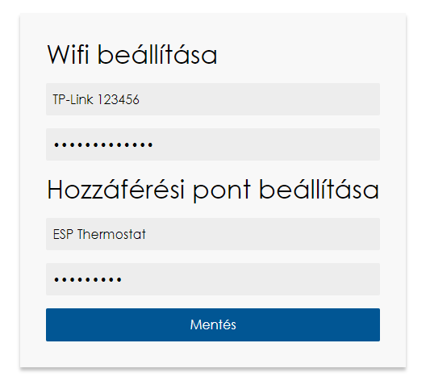

# Access point info
- Connect to the wifi (default credentials can be found in storage.ccp, in clearData())
- Local server http://192.168.4.1/
- Do not open 80 port to the public!

Here you can set up the thermostat to connect to a local Wi-Fi, and you can also change the Access Point credentials. When you save your changes, the thermostat will restart.
